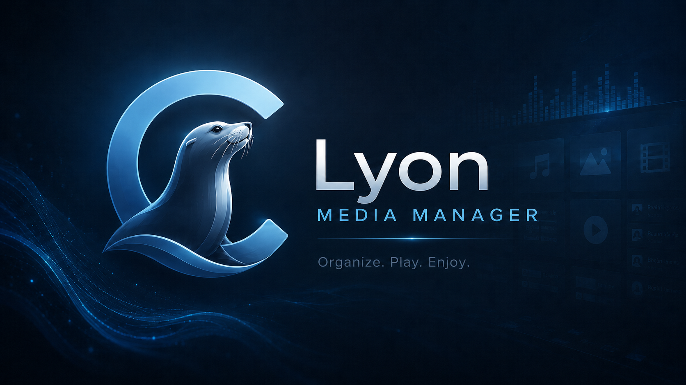

<p align="center">
  
</p>

# Sea Lyon Media Manager

> **Windows 10 / 11 (64-bit) only.** Sea Lyon Media Manager is a desktop
> media manager for local music, podcasts, internet radio, audio CD ripping,
> video playback, YouTube search & download, and library organization.

Sea Lyon is written in Python with PySide6 and uses SQLite, Mutagen,
libVLC, ffmpeg, yt-dlp, CUETools DB, MusicBrainz, TheAudioDB, Cover Art
Archive, LRCLIB, and libdiscid.

**Current version:** `0.9.0-rc1` (LMM-DEV) — see [`lyon/__init__.py`](lyon/__init__.py).
**Targeted public release:** `1.0.0` — see [`IMPLEMENTATION_PLAN_1.0.md`](IMPLEMENTATION_PLAN_1.0.md).

## Downloads & Installation

Public installer downloads will appear on the
[GitHub Releases page](https://github.com/DrShoctopus/Sea-Lyon-Media-Manager/releases)
when v1.0 ships. Each release ships:

- `SeaLyonMediaManager-{version}-Setup.exe` — Inno Setup installer (recommended).
- `SeaLyonMediaManager-{version}-windows.zip` — portable bundle (extract anywhere, run `LyonMusicManager.exe`).
- `SeaLyonMediaManager-{version}-SHA256SUMS.txt` — SHA-256 manifest you can verify with `Get-FileHash`.

### SmartScreen warning (1.0)

The v1.0 installer is **unsigned** — Windows SmartScreen will show a
"Windows protected your PC" dialog. Click **More info → Run anyway** to
proceed, and verify the SHA-256 of the installer matches the value
shipped in `SeaLyonMediaManager-{version}-SHA256SUMS.txt`. Authenticode
code signing is planned for 1.1. Full guidance lives in
[`docs/SMARTSCREEN_NOTES.md`](docs/SMARTSCREEN_NOTES.md).

### Auto-update

The app polls a GitHub-Pages-hosted appcast feed at most once every 24
hours when "Check for updates automatically" is enabled in Settings →
Updates. When a newer release is available, the app surfaces a dialog
with release notes and a "Download Now" button that opens the installer
URL in your browser. Manual checks are available from **Help → Check
for Updates…**.

## Status

`LMM-DEV` is the active development branch tracking the v1.0 release
plan. The repository is feature-complete for v1.0; release-engineering
work (installer polish, auto-update wiring, EULA + privacy + license
attribution) is in flight per [`IMPLEMENTATION_PLAN_1.0.md`](IMPLEMENTATION_PLAN_1.0.md).

Source-only development continues to work on macOS and Linux, but only
Windows is packaged, tested as a release surface, and supported.

## Feature Overview

### App Shell

- Dark Windows Media Player-inspired PySide6 desktop UI.
- Sea-lion app icon, startup splash, and README banner assets under
  `docs/brand/`.
- First-run setup for music roots and library folders.
- Runtime diagnostics for ffmpeg, libdiscid/discid, VLC/libVLC, Python
  packages, and related runtime paths.
- Tabbed About dialog with full third-party license texts, privacy
  policy link, EULA link, and clickable log-folder path.
- Help → **Open Log Folder**, **Copy Diagnostics to Clipboard**, and
  **Check for Updates…** entry points for support and updates.
- Persistent Settings dialog for library paths, ripping, metadata
  providers, YouTube download defaults, playback, equalizer, DLNA, and
  auto-update preferences.

### Library Management

- SQLite-backed library at the user's app-data location.
- Scans audio files: `.flac`, `.mp3`, `.m4a`, `.aac`, `.ogg`, `.opus`,
  `.wav`, `.aiff`, `.aif`, and `.wma`.
- Scans video files: `.mp4`, `.mkv`, `.webm`, `.avi`, and `.mov`.
- Reads audio/container metadata with Mutagen.
- Browse by genre, artist, album, track, playlists, and virtual
  collections.
- Search across title, artist, album artist, album, and display
  fallbacks.
- List, simple, and grid-oriented library views.
- Add folders, watch saved roots for changes, incrementally rescan,
  remove missing files, and drag/drop media.
- Manual and smart playlists, playlist export to M3U, and queue-to-
  playlist save.
- Track ratings, liked tracks, play count, recently played, most
  played, and top rated views.
- Duplicate-track finder that removes library records without deleting
  files.
- Metadata editing, batch metadata editing, and MusicBrainz metadata
  fetch for existing albums.

### Music Playback

- libVLC-backed local audio playback.
- Queue restore on startup, enqueue, reorder, remove, previous/next,
  seek, stop, volume, mute, shuffle, repeat all, and repeat one.
- Persistent bottom transport and Now Playing view.
- Crossfade support with configurable overlap.
- Gapless playback (when crossfade is off).
- ReplayGain (off / track / album modes) with pre-amp and clip
  prevention.
- Sleep timer from the main toolbar.
- Windows media-key support (WM_APPCOMMAND).
- Cast local playback to a DLNA/UPnP MediaRenderer (smart TV / AV
  receiver) via the Cast toolbar button; all AVTransport SOAP runs
  off the UI thread.
- Last.fm + ListenBrainz scrobbling with offline auth flow.
- Playback-unavailable fallback so the app can still open when
  VLC/libVLC is missing.

### Podcasts And Radio

- First-class Podcasts tab for saved RSS/Atom podcast feeds.
- Add individual podcast feeds or import OPML subscription lists.
- Background podcast refresh with searchable episode catalog.
- Podcast episode playback uses the same libVLC stream pipeline as
  the main audio player.
- Internet Radio tab for saved live streams and imported M3U/PLS
  playlists.

### Equalizer And Now Playing

- 10-band libVLC equalizer with preamp.
- Built-in curves, flat reset, custom saved curves, and live preview
  while sliders move.
- Equalizer settings apply to both audio playback and video playback.
- Now Playing cover art, blurred background, format strip, rating
  control, queue preview, album info, and synced/plain lyrics.
- Lyrics lookup order: `.lrc` sidecar, embedded tags, then LRCLIB
  when enabled.
- In-memory lyrics cache is capped to avoid unbounded growth.

### CD Detection, Metadata, And Ripping

- Windows optical-drive detection through Win32 APIs.
- libdiscid support for MusicBrainz disc IDs and table-of-contents
  data.
- CUETools DB-compatible TOC reading through Windows APIs.
- Duplicate disc detection by saved disc ID, with automatic eject
  notification.
- Metadata provider order for discs: CUETools DB first, then
  MusicBrainz, then TheAudioDB enrichment where useful.
- Artwork from Cover Art Archive, CUETools DB metadata URLs, and
  TheAudioDB.
- ffmpeg/libcdio ripping when available.
- Windows raw CD-DA reader fallback when ffmpeg lacks libcdio
  support.
- Output formats: FLAC, MP3, AAC/M4A, Opus, OGG Vorbis, ALAC, WAV,
  AIFF, and WMA.
- FLAC compression and lossy bitrate settings.
- Organized output under
  `<Artist>/<Year> - <Album>/<Track> - <Title>.<ext>`.
- Unknown-album rips get numbered folders to avoid accidental
  overwrites.
- Per-track progress, cancellation, retry failed tracks, failure
  logs, Mutagen tag writing, embedded cover art, optional eject after
  rip, and library import after each completed track.
- Optional CUETools DB AccurateRip v1 verification for FLAC rips.

### Video

- libVLC video player tab with local video catalog sidebar.
- Optical **Disc** tab for Windows Audio CD playback plus DVD/VCD
  launch through the VLC video player.
- Thumbnail cards from library artwork or yt-dlp sidecar images.
- Open file, play/pause/stop, seek, volume, mute, and playback rate
  from 0.25x to 2x.
- Audio-track and subtitle-track selection.
- External subtitle loading.
- PNG/JPEG snapshots through libVLC.
- Fullscreen mode with keyboard controls and OSD feedback.
- Video playback pauses automatically when leaving the Video tab.

### YouTube

- Native Qt YouTube search tab backed by yt-dlp; no WebEngine page
  is required.
- A one-time **ToS acknowledgement gate** appears the first time you
  enter the YouTube tab or open the download dialog. Sea Lyon does
  not grant any right to content you do not independently have
  permission to obtain; see [`EULA.txt`](EULA.txt).
- Result list with thumbnails, duration, channel, view count, and
  click-to-download.
- Download dialog for audio-only or video downloads.
- Audio formats: FLAC and MP3.
- Video formats: MP4, MKV, and WebM.
- Optional playlist downloads.
- yt-dlp progress log and automatic library import for completed
  files.
- ffmpeg is used for extraction, merging, thumbnails, metadata, and
  subtitles when available.

## Requirements (source runs)

Most users should install via the public installer. The notes below
cover **running from source** for development.

### Python Runtime

- Python 3.11+ 64-bit is the recommended development/runtime target.
- Install pinned runtime packages from `requirements.txt`:

```cmd
pip install -r requirements.txt
```

Runtime installs use the hashed lock in `requirements.txt`, generated
from `requirements.in`. Build machines should install the hashed
`requirements-build.txt`, generated from `requirements-build.in`, which
layers PyInstaller, pytest, and build-only icon tooling on top of the
runtime dependencies.

### Native Runtime Files

For full playback, ripping, and CD support, place native binaries in
`bin/` at the repository root (the GitHub Actions workflow and
`scripts\build-windows.ps1` do this automatically with SHA-256
verification):

```text
bin/
  ffmpeg.exe
  discid.dll
  fpcalc.exe
  vlc/
    libvlc.dll
    libvlccore.dll
    plugins/
```

- ffmpeg should include CDDA/libcdio support when possible. On
  Windows, Lyon can fall back to its raw CD-DA reader if libcdio is
  unavailable.
- The VLC runtime must match the Python/app architecture. Use 64-bit
  VLC with 64-bit Python.
- The app launches without these binaries, but CD detection,
  ripping, local audio playback, video playback, audible EQ, and
  AcoustID fingerprinting need the relevant runtime.

## Running From Source

Source-only support is intended for developers and contributors. The
public surface is Windows; macOS and Linux are best-effort.

```cmd
py -3.11 -m venv .venv
.venv\Scripts\activate
python -m pip install --upgrade pip
pip install -r requirements.txt

:: Add ffmpeg.exe, discid.dll, fpcalc.exe, and the VLC runtime under bin\
:: (or run scripts\build-windows.ps1 -SkipZip -SkipInstaller to populate bin\)

py main.py
```

## Data Locations

User data lives outside the repository in `%APPDATA%\LyonMusicManager\`:

- `settings.json` — app preferences (chmodded 0600 on Windows).
- `library.sqlite3` — the SQLite media index.
- `logs/sea-lyon.log` — rotating application log (10 MB × 5 backups).
- `metadata-diagnostics.log` — only when metadata diagnostics are
  enabled in Settings.
- `cache/` — album artwork and metadata response cache.

Ripped music defaults to `Music\Lyon` under the current user, and
YouTube downloads default to `<music_root>\YouTube` unless changed in
Settings.

Use **Help → Open Log Folder** to jump to the logs directory.
**Help → Copy Diagnostics to Clipboard** packages the recent logs +
sanitised settings (scrobbler tokens redacted) into a paste-friendly
text bundle for support emails.

## Using The App

1. Run the installer or start the source tree with `py main.py`.
2. Complete first-run setup, choose a music root, and add existing
   library folders.
3. Use **Library** to scan, browse, search, rate, like, edit metadata,
   create playlists, and play tracks.
4. Use the bottom transport or **Now Playing** for playback, queue,
   ratings, lyrics, shuffle/repeat, seek, volume, and track info.
5. Use **EQ** for the 10-band equalizer, preamp, presets, and custom
   curves.
6. Use **Disc** for Audio CD playback through the queue/transport, or
   to open DVD/VCD media through the VLC video player.
7. Use **Rip** after adding ffmpeg and libdiscid/VLC runtime files (or
   running the installer, which bundles them).
8. Use **Video** for local video playback, fullscreen, subtitles,
   screenshots, and catalog browsing.
9. Use **YouTube** to search with yt-dlp and download audio or video
   into the configured output folder.
10. Use **Help → Runtime Diagnostics** when a native dependency is
    missing or a packaged build behaves differently from a source
    run.

## Repository Layout

```text
main.py                         Top-level launcher
lyon/__init__.py                App name and version
lyon/app.py                     QApplication setup, logging, splash, main window
lyon/core/cd_detect.py          Windows CD-drive, TOC, libdiscid, eject helpers
lyon/core/ctdb_lookup.py        CUETools DB metadata helpers
lyon/core/ctdb_verify.py        AccurateRip v1 verification against CTDB
lyon/core/diagnostics.py        Runtime dependency checks + bundle generator
lyon/core/equalizer.py          10-band EQ limits and presets
lyon/core/library.py            SQLite media library and playlist queries
lyon/core/media_keys.py         Windows media key integration
lyon/core/metadata.py           CTDB, MusicBrainz, TheAudioDB, artwork lookups
lyon/core/player.py             Audio queue, transport, crossfade, EQ state
lyon/core/playback_backend.py   libVLC audio backend and fallback backend
lyon/core/podcast.py            Podcast feed parsing, OPML import, UA helper
lyon/core/ripper.py             ffmpeg/raw-CDDA ripping worker
lyon/core/scrobbler.py          Last.fm + ListenBrainz scrobbling service
lyon/core/settings.py           Settings model, persistence, bundled-bin paths
lyon/core/smart_playlist.py     Smart playlist rules and SQL conversion
lyon/core/tagger.py             Mutagen tag and artwork writing
lyon/core/updater.py            Sparkle-style appcast poller + worker
lyon/core/vlc_equalizer.py      Shared libVLC equalizer controller
lyon/core/yt_downloader.py      yt-dlp download worker
lyon/ui/                        Main window, views, dialogs, widgets, theme
docs/brand/                     Checked-in brand assets
docs/BUILD.md                   Windows build guide
docs/reviews/                   Historical engineering review notes
build/lyon.spec                 PyInstaller spec
build/lyon.iss                  Inno Setup script
scripts/build-windows.ps1       Windows build automation
scripts/README.md               Build-script notes
tests/                          Pytest suite (700+ tests)
requirements.txt                Hashed Python runtime dependency lock
requirements.in                 Runtime deps input for uv pip compile
requirements-build.txt          Hashed build/test dependency lock
requirements-build.in           Build/test deps input for uv pip compile
CHANGELOG.md                    Release notes (Keep a Changelog format)
EULA.txt                        End-user license agreement (MIT + tail)
PRIVACY.md                      Privacy policy (no telemetry)
THIRD_PARTY_NOTICES.txt         Bundled-dependency licenses
IMPLEMENTATION_PLAN_1.0.md      Full v1.0 release plan
```

## Testing

Install pytest in the active environment if needed:

```cmd
pip install pytest
pytest
```

Useful narrower checks:

```cmd
python -m compileall -q main.py lyon tests
pytest tests/test_player_equalizer.py
pytest tests/test_ripper.py tests/test_ctdb_verify.py
pytest tests/test_main_window_integration.py
pytest tests/test_updater.py tests/test_logging_and_diagnostics.py
```

Current coverage spans settings, dialogs, library queries, smart
playlists, metadata provider fallbacks, CUETools DB lookup and
verification, ripping command/failure paths, CD detection helpers,
playback backend fallback, equalizer behavior, transport, Now Playing
lyrics cache, video player handoff, branding, accessibility, UI
dependencies, packaging checks, logging + diagnostics bundling, and
the auto-update appcast parser.

## Resource Lifecycle Notes

The app uses long-lived native and background resources. The current
codebase intentionally closes or bounds them:

- SQLite connections are closed from `MainWindow.closeEvent`.
- Shared metadata HTTP sessions and diagnostics file handlers are
  closed from `metadata.shutdown()`.
- libVLC audio/video players and instances are released during
  shutdown.
- Windows DLL-directory handles for libdiscid and VLC are retained
  while needed and closed on app exit.
- Ripper, YouTube search/download, metadata fetch, library scan, and
  update-check workers are joined or cleaned up before their owning
  UI is destroyed.
- Video thumbnail and lyrics caches are capped.
- YouTube thumbnail network replies are cancelled when results are
  replaced or the YouTube view shuts down.

## Windows Builds

### Recommended: GitHub Actions

`.github/workflows/windows-build.yml` is the canonical release
pipeline. Trigger it via `workflow_dispatch` (or, for tagged releases,
via `git tag v*.*.* && git push`). The workflow:

1. Installs Python deps.
2. Runs the full pytest suite and aborts on failure (or if the
   collected count drops below `PYTEST_FLOOR`).
3. Downloads ffmpeg / libdiscid / VLC / fpcalc with SHA-256
   verification against upstream checksum sidecars.
4. Smoke-tests imports, VLC backend, and fpcalc.
5. Builds the PyInstaller bundle.
6. Compiles `build\lyon.iss` with Inno Setup.
7. Emits SHA256SUMS for the installer + portable zip.
8. Uploads the installer, zip, and SHA256SUMS as a single artifact.

### Local script

```powershell
scripts\build-windows.ps1
```

Useful flags:

```powershell
scripts\build-windows.ps1 -Clean
scripts\build-windows.ps1 -SkipBinaries
scripts\build-windows.ps1 -SkipZip
scripts\build-windows.ps1 -SkipInstaller
```

See [`docs/BUILD.md`](docs/BUILD.md) for the longer build guide
including registry layout, SmartScreen notes, and reproducible build
notes.

## Troubleshooting

Open **Help → Runtime Diagnostics** first to inspect ffmpeg,
libdiscid/discid, fpcalc, VLC/libVLC, and DLNA networking. Then
**Help → Copy Diagnostics to Clipboard** packages the recent logs
plus a redacted settings snapshot for support.

- **Audio playback is unavailable** — confirm `python-vlc` is
  installed and a 64-bit VLC runtime is discoverable or present under
  `bin\vlc\`.
- **Video player shows the unavailable screen** — fix the same
  VLC/libVLC setup used for audio playback and EQ.
- **Equalizer controls move but sound does not change** — the audible
  EQ requires libVLC, not just the Qt UI.
- **`ffmpeg not found` while ripping or downloading audio** — place
  `bin\ffmpeg.exe` in the repo root or install ffmpeg on `PATH`. The
  installer ships ffmpeg.
- **No CD drive appears** — confirm Windows sees the optical drive
  and that an audio CD is inserted.
- **Disc metadata does not resolve** — keep CUETools DB metadata
  lookup enabled, confirm internet access, and set a real MusicBrainz
  contact value in Settings → Metadata.
- **YouTube search/download fails** — confirm `yt-dlp` is installed
  in the active environment. ffmpeg is also needed for high-quality
  video merging and audio conversion.
- **SmartScreen warning at install** — expected for 1.0. Click
  "More info → Run anyway". See
  [`docs/SMARTSCREEN_NOTES.md`](docs/SMARTSCREEN_NOTES.md) for the
  full FAQ, including how to verify the SHA-256 hash before running.
  A signed build is planned for 1.1.

## Legal & Privacy

- [`EULA.txt`](EULA.txt) — End-User License Agreement (MIT + user-
  responsibility tail for CD ripping, YouTube downloading, DLNA
  broadcasting, scrobbling).
- [`PRIVACY.md`](PRIVACY.md) — Privacy policy. **No telemetry.** All
  network calls are listed.
- [`THIRD_PARTY_NOTICES.txt`](THIRD_PARTY_NOTICES.txt) — Per-
  dependency license attribution. The bundle is effectively GPL-2+
  because the ffmpeg "essentials" build links libx264/libx265 (planned
  swap to strict-LGPL for 1.1).
- [`CHANGELOG.md`](CHANGELOG.md) — Release notes.

## Credits And Services

Sea Lyon Media Manager uses Qt/PySide6, libVLC, ffmpeg, libdiscid,
Chromaprint, CUETools DB, MusicBrainz, TheAudioDB, Cover Art Archive,
yt-dlp, Mutagen, requests, defusedxml, watchdog, and pyacoustid.
Respect MusicBrainz access policies by setting an appropriate
app/contact value before distributing builds or performing heavy
metadata lookups (the default contact points at the project's GitHub
repo and is honored by the MusicBrainz / CUETools DB / Cover Art
Archive User-Agent strings the app sends).
